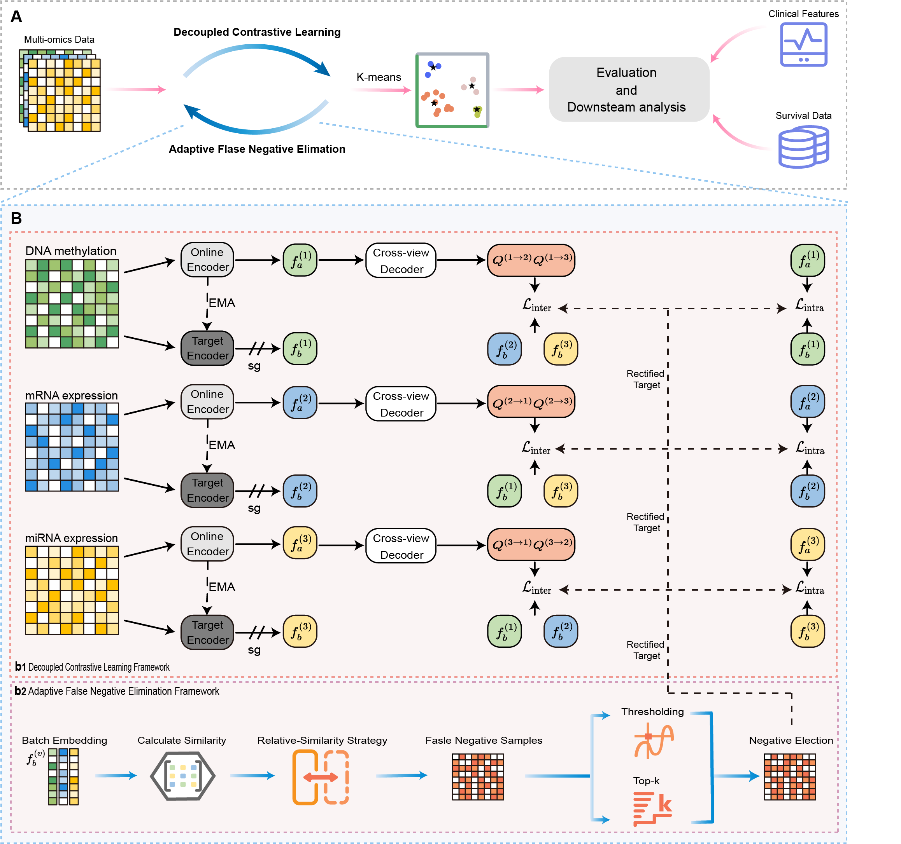

# Decoupled contrastive multi-view clustering with adaptive false negative elimination for cancer subtyping

## 🧠 DCMC_model

## 📦 Requirements

pytorch>=1.13.0  
munkres>=1.1.4  
numpy>=1.23.4  
pandas>=2.2.3  
PyYAML>=6.0.2  
scikit_learn>=1.4.2  
scipy>=1.10.1  

<<<<<<< HEAD
All required packages are listed in the [requirements.txt](./requirements.txt) file.
=======

>>>>>>> fc87a1888369993210944cd509d4993375509c05

## 📊 Datasets

The multi-omics and patient clinical data for 10 cancers used in this study are publicly available.  
Data can be accessed via the TCGA platform at https://portal.gdc.cancer.gov, while all multi-omics, survival, and clinical data employed in our experiments are sourced from http://acgt.cs.tau.ac.il/multi_omic_benchmark/download.html.

## 🚀 Training

For the 10 cancer datasets, the hyper-parameters and training options are defined in the configuration file.

~~~bash
main_train.py --config_file=config/caner_name.yaml
~~~

## 📬 Contact

If you have any questions, please feel free to contact us using the email address provided in the article.
